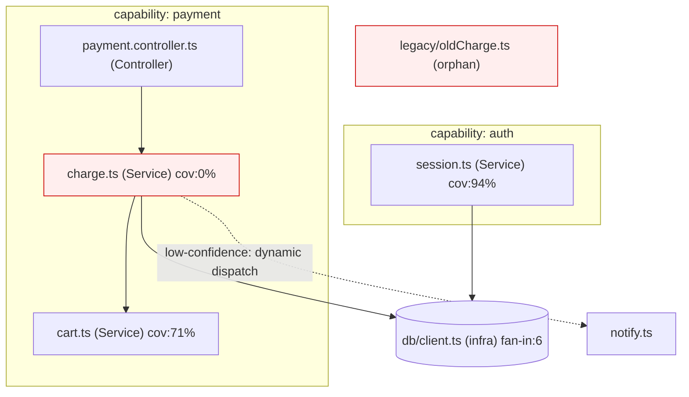

> **Sample output.** An illustrative `.assessment/knowledge-graph.md` for a hypothetical
> payments service, kept as a format example. Not a real repo — run `/assess graph` on yours.

assessed_at_commit: 9f2c1ab
intent_spec_hash: sha256:4d1a…
generated: 2026-06-15

# Knowledge Graph

## Overview

## Capability: payment  — readiness: partial

- **Purpose**: take a validated cart and charge the customer exactly once.
- **Intent**: `intent:payment.validate_before_charge` (CRITICAL — money path).
- **Owned components**:

| Component | Role | Fan-in / out | Coverage | Ownership | Evidence |
|---|---|---|---|---|---|
| `payment/charge.ts` | Service | 3 / 2 | 0% | owned | call graph; coverage report |
| `payment/cart.ts` | Service | 1 / 1 | 71% | owned | call graph |
| `payment/payment.controller.ts` | Controller | 1 (HTTP) / 1 | 40% | owned | route table |

- **Key edges**: `payment.controller → charge → {cart, db}`; inbound to `charge` also from
  `stripe-webhook` and `retryJob` (both critical-path callers).
- **Readiness**: partial — the charge service is on a money path with 0% coverage. → see `A-001`, `C-004`.

## Capability: auth  — readiness: ready

- **Purpose**: issue and expire sessions. `intent:auth.session_expiry`.
- `auth/session.ts` (Service, cov 94%) — owned, healthy. No open findings.

## Cross-cutting components

| Component | State | Note |
|---|---|---|
| `db/client.ts` | infrastructure | primary owner: platform; consumers: payment, auth. fan-in 6. |
| `legacy/oldCharge.ts` | **orphan** | no inbound edges, no capability claims it. → `A-007` (unexplained). |
| `notify.ts` | hidden | reached only via a low-confidence dynamic-dispatch edge; needs runtime confirmation. |

## Gap callouts

- **A-007 (code→intent / unexplained)**: `legacy/oldCharge.ts` is an orphan with no inbound
  edges and no owning capability. Missing-code proof: `absent` (full call-graph coverage, no
  residue) → dead code candidate, P2.
- **A-001 (intent→code / misalignment)**: `intent:payment.validate_before_charge` maps to
  `charge.ts`, but the node has 0% coverage on a critical path → see report, P0.
- The `charge → notify` edge could not be resolved statically (dynamic dispatch); shown dashed,
  not asserted. Recommend a runtime trace before relying on it.
