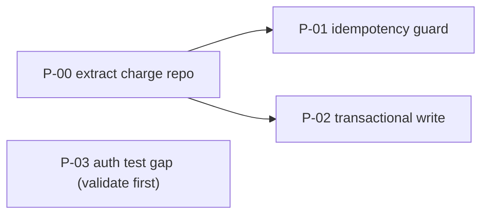

> **Sample output.** An illustrative `.assessment/implementation-plan.md` derived from the
> findings in the payments example, kept as a format example. `assess` produces the plan but
> never executes it.

assessed_at_commit: 9f2c1ab
intent_spec_hash: sha256:4d1a…
generated: 2026-06-15

# Implementation Plan

**Summary**: 1 P0, 1 P1, 1 P2; one prerequisite refactor (P-00); two tracks can run in parallel.
Handoff only — `assess` does not apply these changes.

## Ordered items

### [P-00] Extract a shared charge repository

- **Closes**: prerequisite for P-01 and P-02 (not a finding on its own).
- **Targets**: `capability:payment` → new `payment/charge.repo.ts`, refactor `charge.ts:40-78`.
- **Change direction**: move the gateway-call + DB-write out of the service into a repository
  with a single write path, so the guard and the transaction can be added in one place.
- **Blast radius**: 1 component now, unblocks 2 fixes. Low risk (no behavior change intended).
- **Acceptance**: `charge.ts` no longer writes directly; existing tests still green.

### [P-01] Add an idempotency guard to the charge path

- **Closes**: A-001 (P0, alignment/misalignment), C-004 (P1, correctness).
- **Intent**: `intent:payment.validate_before_charge` (CONFIRMED, CRITICAL).
- **Targets**: `payment/charge.repo.ts`, `stripe-webhook` handler.
- **Change direction**: dedup key from the order id, checked before the charge write; webhook
  returns early on a seen key. (Direction — not code.)
- **Blast radius**: 2 components, 3 inbound callers (`checkout`, `stripe-webhook`, `retryJob`).
  Money critical path → review + tests first.
- **Depends on**: P-00.
- **Acceptance**: the A-001 missing-code proof for a guard flips present; `charge` coverage
  0% → covers the double-submit path; retry test asserts a single charge.
- **Effort / risk**: M / high. Evidence strength carried in: verified.

### [P-02] Wrap charge + order write in one transaction

- **Closes**: C-009 (P2, correctness — partial write on failure).
- **Targets**: `payment/charge.repo.ts`.
- **Depends on**: P-00. Can run in parallel with P-01 after P-00 lands.
- **Acceptance**: an injected failure mid-write leaves no orphaned `orders` row (new test).

### [P-03] Cover the auth session-expiry edge cases  — validate first

- **Closes**: Q-011 (P2, quality — untested branch). Evidence strength: inferred.
- **Targets**: `capability:auth` → `auth/session.ts`.
- **Note**: tagged *validate first* — step 1 is to write the failing test that proves the
  branch is actually unhandled before any change.
- **Parallel**: shares no components with payment → independent track.

## Dependency view

## Parallel tracks

- **Track A (payment)**: P-00 → then P-01 and P-02 in parallel.
- **Track B (auth)**: P-03, independent.

## Out of scope / accepted

- `A-007` orphan `legacy/oldCharge.ts`: deletion proposed but deferred — see `baseline-debt.md`
  (accepted until the v2 cleanup, review date set).

## Handoff

`assess` does not execute this plan. Hand it to the team, an executor agent, or a tool like
`improve`. Re-run `/assess reconcile` after changes land to confirm each acceptance criterion.
